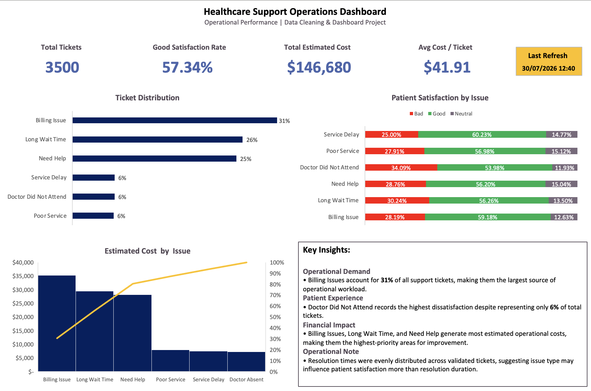

# Healthcare Support Operations Dashboard

## Project Overview

This project demonstrates an end-to-end data analysis workflow using Microsoft Excel and Power Query. Starting from a messy operational dataset, the project covers data cleaning, validation, exploratory analysis, and dashboard development.

The objective was to transform raw operational data into reliable information that supports reporting and operational decision-making in a simulated healthcare environment.

---

## Dataset

| Item | Description |
|------|-------------|
| Sector | Healthcare Operations |
| Environment | Simulated operational support tickets |
| Reporting Period | January – June 2025 |
| Records | 3,500 |
| Columns | 27 |
| Geographic Coverage | Multiple countries |

The dataset intentionally contains common data quality issues, including inconsistent formats, missing values, duplicate identifiers, and inconsistent categorical values to simulate a realistic cleaning scenario.

---

## Data Cleaning

Data cleaning and preparation were performed entirely using **Power Query**.

Main transformations included:

- Standardized ticket, patient, and visit identifiers
- Cleaned and standardized categorical variables
- Converted multiple date formats into a consistent format
- Converted response and resolution times into numeric values
- Standardized patient satisfaction categories
- Cleaned and grouped free-text ticket descriptions
- Validated duplicates, missing values, and data types

Several helper columns were created during the cleaning process while preserving the original raw values whenever possible.

---

## Data Validation

The cleaned dataset was validated to ensure it was suitable for analysis.

Validation included:

- Duplicate ticket verification
- Missing value profiling
- Data type validation
- Category consistency checks
- Date conversion validation
- Logical review of created and resolved dates

Records with unresolved business rules were preserved and documented rather than modified.

---

## Exploratory Data Analysis

After cleaning, exploratory analysis was performed to answer practical business questions such as:

- Which service issues generate the highest operational workload?
- Which issues have the greatest impact on patient satisfaction?
- Where are estimated operational costs concentrated?
- Do operational variables influence service outcomes?
- Are demographic patterns observable?

Only analyses that produced meaningful operational insights were included in the final dashboard.

---

## Dashboard

The dashboard summarizes the most important operational indicators in a single-page executive view.

### KPIs

- Total Tickets
- Good Satisfaction Rate
- Total Estimated Cost
- Average Cost per Ticket

### Visualizations

- Ticket Distribution by Service Issue
- Patient Satisfaction by Issue
- Estimated Cost by Issue (Pareto)
- Executive Key Findings

The dashboard was designed using Excel PivotTables and remains refreshable after updating the Power Query transformations.

---

## Key Findings

- Billing Issues represented the largest operational workload, accounting for approximately **31%** of all support tickets.
- Doctor Did Not Attend recorded the highest proportion of dissatisfied patients despite representing only a small share of total requests.
- Billing Issues, Long Wait Time, and Need Help generated the largest share of estimated operational costs, making them the highest-priority areas for improvement.
- Resolution time showed limited variation across validated records, suggesting that issue type may influence patient satisfaction more than resolution duration.

---

## Skills Demonstrated

- Microsoft Excel
- Power Query
- Data Cleaning
- Data Validation
- Exploratory Data Analysis (EDA)
- PivotTables
- Dashboard Design
- Business Reporting
- Data Visualization

---

## Files

- **Healthcare_Support_Operations_Dashboard.xlsx** – Complete workbook containing the full cleaning process, PivotTables, analysis, and dashboard.
- **Raw_Dataset.xlsx** – Original dataset used for the project.
- **Dashboard.png** – Dashboard preview.

